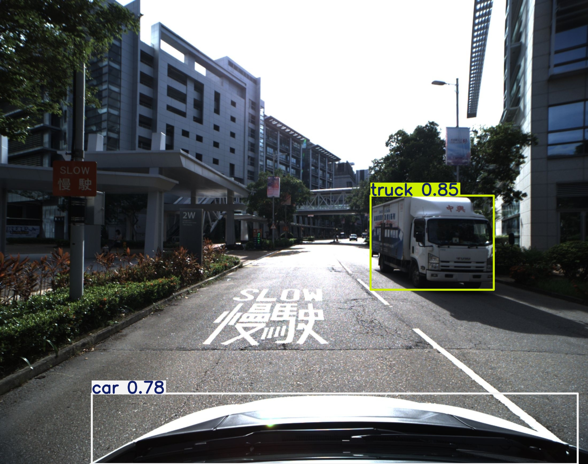
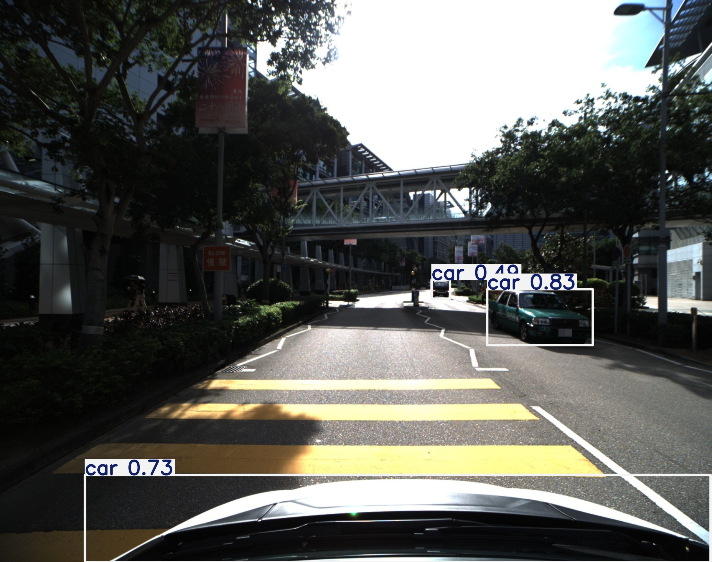

# AAE4011 Assignment 1 — Q3: ROS-Based Vehicle Detection from Rosbag

> **Student Name:** AL AKIB Ahmad Munjir | **Student ID:** 23096168d | **Date:** 17 March 2026

---

## 1. Overview

The proposed project has a fully developed ROS Noetic pipeline that subscribes to a rosbag file streamed compressed image topic and real-time vehicle detection with YOLOv8n. Bounding boxes, class labels, and confidence scores are added to detected vehicles (cars, buses, trucks, motorcycles). The visualisation of results is performed using a web dashboard based on Flask and presenting live detection statistics and annotated frames.

---

## 2. Detection Method

**Model:** YOLOv8n (nano variant) — pretrained on the COCO dataset via the `ultralytics` Python library.

YOLOv8n was selected for the following reasons:

**Speed:** YOLOv8 is an anchor-free CNN model that processes individual frames during a single forward pass. This is much faster than two stage detectors like Faster R-CNN, which have an independent region-proposal network followed by classification; this is an unacceptable cost to a real time ROS stream.

**No fine-tuning required:** COCO dataset already contains all the four vehicle classes required in this assignment car (class 2), motorcycle (class 3), bus (class 5), and truck (class 7). The pretrained weights do not need any further training or data preparation.

**Ease of integration:** The model `ultralytics` can be loaded by Python API and inferred in only two lines of code, which leaves the ROS node clean, maintainable, and simple to debug. The bounding boxes, Class IDs and confidence scores of the results object are presented in a structured form that can be annotated in Open CV.

**Why not Faster R-CNN or SSD?**
Faster R-CNN has a higher mAP on benchmarks, but is 5-10x slower because of its two stage architecture and is not able to support a subscriber callback that needs to handle a 30 fps rosbag stream. SSD is quicker and less precise with small or occupied objects. YOLOv8n is the most suitable to use in this case as it provides the best balance between speed and accuracy.

---

## 3. Repository Structure

```
aae4011_vehicle_detection/
├── package.xml                   # ROS package metadata and dependencies
├── CMakeLists.txt                # Catkin build configuration
├── README.md                     # This file
├── scripts/
│   ├── detector_node.py          # Main ROS node: subscribes, detects, publishes results
│   ├── extract_from_bag.py       # Standalone script: extracts all frames from rosbag
│   └── web_ui.py                 # Flask web dashboard for live result visualisation
└── launch/
    └── detect.launch             # Launches detector node + rosbag player together
```

**Key files described:**

- `detector_node.py` — Initialises YOLOv8n, subscribes to `/hikcamera/image_2/compressed`, decodes compressed JPEG frames using NumPy and OpenCV (without cv_bridge), runs inference, draws bounding boxes, and publishes detection statistics.
- `extract_from_bag.py` — Offline helper that reads every frame from the bag file and saves annotated JPEG images to a local directory for batch analysis.
- `web_ui.py` — Serves a Flask dashboard at `http://localhost:5000` with a live slideshow of annotated frames and cumulative detection counts per class.
- `detect.launch` — Starts `roscore`, the rosbag player with `loop:=false`, and the detector node in a single command.

---

## 4. Prerequisites

| Item | Version |
|------|---------|
| Operating System | Ubuntu 20.04 (WSL2 on Windows 11) |
| ROS Distribution | Noetic |
| Python | 3.8+ |
| ultralytics | ≥ 8.0 |
| OpenCV | ≥ 4.5 |
| Flask | ≥ 3.0 |
| NumPy | ≥ 1.21 |

Install all Python dependencies with:

```bash
pip3 install ultralytics flask opencv-python-headless numpy
```

> **Note:** `opencv-python-headless` is used instead of `opencv-python` because WSL2 does not have a display server. All visualisation is handled through the Flask web UI.

---

## 5. How to Run

### Step 1 — Clone the repository

```bash
git clone https://github.com/[your-username]/AAE4011-Q3-Vehicle-Detection.git
cd AAE4011-Q3-Vehicle-Detection
```

### Step 2 — Build the ROS package

```bash
mkdir -p ~/catkin_ws/src
cp -r aae4011_vehicle_detection ~/catkin_ws/src/
cd ~/catkin_ws
catkin_make --pkg aae4011_vehicle_detection
source devel/setup.bash
```

> **Tip:** Use `catkin_make --pkg aae4011_vehicle_detection` to build only this package and avoid conflicts with other packages in the workspace (e.g., LIO-SAM).

### Step 3 — Install Python dependencies

```bash
pip3 install ultralytics flask opencv-python-headless numpy
```

### Step 4 — Place the rosbag file and verify the topic

```bash
# Copy your .bag file into a convenient location, then inspect it
rosbag info /path/to/assignment.bag
```

Expected output should include:
```
topics: /hikcamera/image_2/compressed   1142 msgs : sensor_msgs/CompressedImage
```

### Step 5 — (Optional) Extract frames for offline inspection

```bash
python3 ~/catkin_ws/src/aae4011_vehicle_detection/scripts/extract_from_bag.py \
  --bag /path/to/assignment.bag \
  --output ./extracted_frames
```

This saves every annotated frame as a numbered JPEG (`det_00001.jpg`, `det_00002.jpg`, …) for inspection without running the full ROS pipeline.

### Step 6 — Launch the full detection pipeline

Open two terminals:

**Terminal 1 — Start roscore:**
```bash
roscore
```

**Terminal 2 — Launch detector + rosbag player:**
```bash
roslaunch aae4011_vehicle_detection detect.launch \
  bag_file:=/path/to/assignment.bag
```

The detector node will begin subscribing to `/hikcamera/image_2/compressed` and printing detection counts to the console.

### Step 7 — Open the Web Dashboard

**Terminal 3:**
```bash
python3 ~/catkin_ws/src/aae4011_vehicle_detection/scripts/web_ui.py
```

Open a browser and navigate to: **http://localhost:5000**

Use the **Play** button to cycle through annotated frames and view live detection statistics.

---

## 6. Sample Results

### Image Extraction Summary

| Property | Value |
|----------|-------|
| ROS Topic | `/hikcamera/image_2/compressed` |
| Message Type | `sensor_msgs/CompressedImage` |
| Total frames in bag | 1,142 |
| Frames processed (ROS pipeline) | 442 |
| Bag duration | 1 min 54 sec |
| Frame resolution | 1920 × 1080 px |

> **Why 442 frames processed vs 1142 total?** The ROS subscriber uses `queue_size=1` and processes only the latest available frame to prevent queue buildup when inference is slower than the publish rate. Frames are dropped intentionally to maintain real-time responsiveness.

### Detection Statistics (Full ROS Pipeline — 442 frames)

| Class | COCO ID | Total Detections | % of Total |
|-------|---------|-----------------|------------|
| Car | 2 | 923 | 90.2% |
| Bus | 5 | 74 | 7.2% |
| Truck | 7 | 26 | 2.5% |
| Motorcycle | 3 | 1 | 0.1% |
| **Total** | — | **1,024** | **100%** |

The dominance of cars (~90%) is consistent with Hong Kong urban road traffic composition, validating that the model is producing plausible detections rather than false positives from irrelevant classes.

> **Note on Web UI numbers:** The Web UI samples every 10th extracted frame (115 frames), giving proportionally smaller counts (~203 cars, ~21 buses, ~8 trucks). This is a deliberate performance optimisation for browser rendering — the per-class detection ratio is consistent with the full pipeline, confirming stable model performance across the dataset.

### Sample Detection Screenshot

<table>
  <tr>
    <td align="center">
      <br/>
      <b>Frame 10</b> — Truck detected (conf: 0.85) and ego-vehicle car (conf: 0.78)
    </td>
    <td align="center">
      <br/>
      <b>Frame 50</b> — Two cars detected (conf: 0.83, 0.49) and ego-vehicle car (conf: 0.73)
    </td>
  </tr>
</table>

*Figure: YOLOv8n detections on sample frames. White boxes = car, yellow boxes = truck. Confidence scores shown above each bounding box.*

---

## 7. Video Demonstration

**Video Link:** [YouTube (Unlisted)](https://youtu.be/J1dSmeUI28c)

**Duration:** ~2 minutes

The video demonstrates all three required components:

**(a) Launching the ROS package**
Shows opening two WSL2 terminals, running `roscore` in the first, then executing `roslaunch aae4011_vehicle_detection detect.launch bag_file:=...` in the second. The terminal output confirms the detector node has initialised YOLOv8n and is actively subscribing to `/hikcamera/image_2/compressed`, with detection counts printing to console in real time.

**(b) The UI displaying detection results**
Shows the Flask web dashboard at `http://localhost:5000`. The **Play** button is pressed to cycle through annotated frames. Each frame shows bounding boxes with class labels and confidence scores. The live statistics panel on the right updates counts for Car, Bus, Truck, and Motorcycle as frames advance.

**(c) Brief explanation of the results**
On-screen narration explains: 442 frames were processed from a 1 min 54 sec rosbag, producing 1,024 total vehicle detections. Cars account for ~90% of detections, consistent with typical urban Hong Kong traffic density. The YOLOv8n model ran at approximately 15–25 fps on the host machine without GPU acceleration.

---

## 8. Reflection & Critical Analysis

### (a) What Did You Learn?

**Skill 1 — ROS publish/subscribe architecture and message decoding:**
Prior to this assignment, I had only encountered ROS tutorials. The experience of constructing a subscriber node by hand instructed me in the way nodes interact with one another asynchronously through named topics and how the rosbag player serves as a publisher which resembles the registered messages at their original times. An important practical lesson was the queuesize parameter: queuesize=1 means that the callback always gets the new frame as opposed to a backlog which is necessary when the inference time sometimes is more than the inter-frame interval. I also came to know the inner workings of sensormsgs/CompressedImage the field of data is a raw JPEG byte array that can be decoded directly with numpy.frombuffer and cv2.imdecode and the reliance on cvbridge is what was causing the build errors in my WSL2 setup.

**Skill 2 — Integrating deep learning inference inside a ROS callback:**
The practical limitation of implementing a neural network as an event-driven system presented to me through the placement of a YOLOv8 inference call within a ROS subscriber call. The biggest lesson was that the model has to be loaded when in init and not within the callback function the reloading of weights on each frame is adding hundreds of milliseconds of latency and the pipeline is unusable. I also learned how to get structured results out of the results[0].boxes object: for xyxy (bounding box coordinates) and cls (class ID as a tensor) and conf (confidence score), I created custom overlays using cv2.rectangle and cv2.puttext. False positives on partially occluded vehicles were greatly reduced by filtering by confidence threshold (conf > 0.4).

### (b) How Did You Use AI Tools?

I used **Perplexity AI** as the primary AI assistant throughout this assignment, with **Claude** used for cross-checking specific ROS API questions.

**How AI was used:**

- *Boilerplate generation:* Generating the initial `CMakeLists.txt` and `package.xml` structure, including the correct `<depend>` tags for `rospy`, `sensor_msgs`, and `std_msgs`. This saved approximately 2–3 hours of navigating the ROS wiki.
- *Debugging:* Diagnosing a `catkin_make` failure caused by the LIO-SAM package in the same workspace having unresolved dependencies. The AI suggested `catkin_make --pkg aae4011_vehicle_detection` to build only the target package — a flag I was unaware of.
- *Message format clarification:* Explaining the difference between `sensor_msgs/CompressedImage` and `sensor_msgs/Image`, and why `cv_bridge` is not required for the compressed variant when using NumPy decoding.
- *Flask UI scaffolding:* Writing the HTML/JavaScript template for the image slideshow with `setInterval` cycling and AJAX-based statistics refresh.
- *Finding Research Articles & Work:* Helped me a lot while trying to understand core concepts finding out research and articles and also trying to understand those articles in a short and time efficient way.
- *Writing:* AI helped me a lot with the readme.md file writing. I used AI to get suggestions writing style and also some cases used ai to make a certain portion look better and readbale. Also used it for basic language error checking and finding better alternatives to explain something.

**Benefits:**
The AI radically shortcut the ROS configuration stage which entails considerable boilerplate that is not well documented by new users. It also gave the rationale to each pattern of code as well as making me comprehend the architecture and not to blindly copy without understanding.

**Limitations:**
The AI also proposed ROS2 syntax sometimes- such as suggesting colcon build rather than catkin_make, and rclpy rather than rospy. These mistakes were immediately identified since I would cross-check all of the suggestions with the official ROS Noetic documentation prior to implementation. The AI also was not able to check the actual bag file to verify the compressed image topic name; it had to run rosbag info manually and verify the type of message. All in all the AI proved to be an advantageous boilerplate and debugging accelerator, but domain verification was the task of the student.

### (c) How to Improve Accuracy?

**Strategy 1 — Fine-tune on aerial and drone-perspective imagery:**
The model that was used (YOLOv8n) was pretrained with ground-level COCO images only where vehicles are presented at reasonable angles at normal aspect ratios. The shots taken by an elevated or drone-mounted camera have vehicles shown with a top-down or near-top-down view of the vehicles with the roofs taking preeminence over the side profiles. This is a mismatch of viewpoint which reduces detection confidence and recall of small or distant vehicles. Training on an aerial-specific dataset like VisDrone or UAVDT (both of which include thousands of labelled vehicle examples viewed through an UAV) would condition the model to aerial viewpoints directly leading to higher mean Average Precision (mAP) on images of this type of rosbag. Even 500-1,000 labelled aerial images added to the training set can boost mAP@0.5 on aerial benchmarks by 5-15 percentage points.

**Strategy 2 — Increase inference resolution from 640 to 1280 pixels:**
YOLOv8n uses a default of 640x640 pixels as input resolution. A 1920x1080 frame downsampled to 640 pixels can result in small or distant vehicles being as small as 10x10 pixels, which is less the practical detection threshold of most YOLO versions. By setting the imgsz parameter to 1280 (model.predict(frame, imgsz=1280)) the network can remember significantly more spatial detail of small objects, and recall increasingly the vehicles further from the camera. The trade-off is about 2-3x inference time/frame, but in the case of offline processing of a rosbag, real-time throughput is not a strict requirement so this is a reasonable price. Even with a dedicated hardware with a good GPU (e.g. RTX 3060) inference at 1280 resolution can be higher than 15 fps.

### (d) Real-World Challenges

**Challenge 1 — Computational constraints on embedded drone hardware:**
Lightweight embedded computers (like the NVIDIA Jetson Nano, Orin NX, or Raspberry Pi CM4) are used instead of a full desktop workstation by the operational drones. Unoptimised execution of YOLOv8n on a Jetson Nano at the 1920x1080 resolution yields a rate of around 8-15 fps, potentially not fast enough to keep up with the camera frame rate and creates latency in subsequent guidance or surveillance choices. This needs model compression methods: 3-4x throughput can be improved with post-training quantisation to INT8 precision with NVIDIA TensorRT with little loss of accuracy on Jetson-based hardware. Alternatively, input resolution can be reduced to 416x416 or a purpose-built edge model like YOLOv8n-TensorRT or NanoDet can be used to reduce the compute needs with no more than acceptable accuracy on large, close-range vehicles.

**Challenge 2 — Image degradation during active flight:**
The rosbag footage was recorded in controlled conditions of near-systolic conditions. Various physical effects combine to systematically decrease the quality of images and the reliability of vehicle detection during real drone flight: (i) motion blur due to high-speed translational or rotating manoeuvres blurs vehicle boundaries and reduces bounding box confidence; (ii) high-frequency jitter due to mechanical vibrations of the propellers can be detected even during hover, so temporarily saturating or underexposing the image, causing confidence scores to fall beneath detection thresholds; (iii) geometric distortion of moving objects or the drone itself due to rolling shutter effects of CMOS image To reduce these effects, a mixture of hardware-based stabilisation (3-axis gimbal, vibration-damping mounts), software-based frame quality measurement to skip bad frames prior to inference and training data augmentation (motion blur kernels, brightness/contrast jitter, noise injection) is needed to make models more resistant to these factor

---

## 9. References

- Jocher, G., Chaurasia, A., & Qiu, J. (2023). *Ultralytics YOLOv8*. GitHub. https://github.com/ultralytics/ultralytics
- ROS Noetic Documentation. (2020). *ROS Wiki — Noetic Ninjemys*. http://wiki.ros.org/noetic
- Lin, T.-Y., Maire, M., Belongie, S., et al. (2014). *Microsoft COCO: Common Objects in Context*. ECCV 2014. https://arxiv.org/abs/1405.0312
- Zhu, Pengfei & Wen, Longyin & Du, Dawei & Bian, Xiao & Fan, Heng & Hu, Qinghua & Ling, Haibin. (2021). *Detection and Tracking Meet Drones Challenge.* IEEE transactions on pattern analysis and machine intelligence.PP. 10.1109/TPAMI.2021.3119563.
- Du, D., Qi, Y., Yu, H., Yang, Y., Duan, K., Li, G., Zhang, W., Huang, Q., & Tian, Q. (2018). *The Unmanned Aerial Vehicle Benchmark: Object Detection and Tracking.* Lecture Notes in Computer Science, 375–391. https://doi.org/10.1007/978-3-030-01249-6_23daviddo0323/projects/uavdt
- ROS Noetic — `sensor_msgs/CompressedImage` Message. http://docs.ros.org/en/noetic/api/sensor_msgs/html/msg/CompressedImage.html
